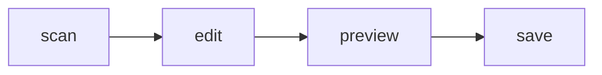

<p align="center">
  
</p>

<h1 align="center">Memoir</h1>

<p align="center">
  <em>Forked and customized from <a href="https://github.com/Memoir-Studio/Memoir">Memoir-Studio/Memoir</a> (MIT License).</em>
</p>

<p align="center">
  <strong>A quiet desktop notebook.</strong><br />
  Open a folder. Write. Preview. Sync.<br />
  Markdown / MDX — still ordinary files, still yours.
</p>

<p align="center">
  English ·
  <a href="./README.zh-CN.md">简体中文</a>
</p>

<p align="center">
  <a href="./LICENSE"></a>
  <a href="https://github.com/Memoir-Studio/Memoir/actions/workflows/test.yml"></a>
  
  
  
</p>

<p align="center">
  
</p>

Memoir is a quiet desktop notebook. Point it at a folder of `.md` / `.mdx` files and you get a library, a CodeMirror editor, and a live preview. Notes stay ordinary files — not a proprietary vault. Optional WebDAV or S3-compatible sync keeps the same folder in step with a remote copy.

Notes are ordinary files. You can open the same folder in git, VS Code, or any other editor.

## Features

- **Your folder, your files** — the workspace is a folder you choose. Notes stay ordinary Markdown / MDX.
- **Cloud sync** — optional two-way WebDAV, AWS S3, and S3-compatible storage such as MinIO, R2, or COS.
- **Markdown and MDX** — GitHub Flavored Markdown, KaTeX, Mermaid, task lists, and a small set of built-in MDX components.
- **Edit / split / preview** — write source, read the rendered page, or do both with synced scroll.
- **Library** — folders, frontmatter tags, favorites, recent notes, and a heading outline.
- **References** — `[[Note]]` wiki links and markdown links to other notes, with backlinks and a workspace graph.
- **Safe by default** — atomic writes, crash-safe drafts, autosave, and deletes that go to `.memoir-trash/` instead of vanishing.
- **Fast library** — each workspace keeps a disposable SQLite cache at `.memoir/index.sqlite` so the sidebar does not re-read every note. The markdown files are still the source of truth; gitignore `.memoir/` and exclude it from iCloud / Dropbox / OneDrive.
- **Appearance** — light / dark / system theme, accent colors, density, type scale, and Chinese / English UI.
- **Sandboxed paths** — only `.md` / `.mdx` inside the workspace; `..`, symlinks, and hidden/build directories are rejected.

### Writing

````md
---
title: Two Sum
tags: [leetcode, rust]
---

# Two Sum

Link another note with `[[Welcome to Memoir]]` or `[home](../welcome.md)`.

Inline math: $O(n)$. Display math:

$$
\sum_{i=1}^{n} i = \frac{n(n+1)}{2}
$$

- [x] Read the prompt
- [ ] Write a test


````

MDX files can use built-in components. `import` / `export` are disabled on purpose so a note cannot pull in arbitrary modules:

```mdx
<Callout type="tip" title="Ordinary files">
  Notes stay Markdown. Cloud sync is optional.
</Callout>

<Card title="Built-in">Callout, Badge, Card, Columns, Steps</Card>
```

## Getting started

Download an installer from [Releases](https://github.com/Memoir-Studio/Memoir/releases/latest):

- **Windows** — `memoir_*_x64-setup.exe`
- **macOS** — `memoir_*_aarch64.dmg` (Apple Silicon) or `memoir_*_x64.dmg` (Intel)
- **Linux** — `memoir_*_amd64.AppImage`, `memoir_*_amd64.deb`, or `memoir-*-1.x86_64.rpm`

The AppImage runs without installation. Make it executable first: `chmod +x memoir_*_amd64.AppImage`.

Open the app, then choose a folder of Markdown / MDX files. That folder is the workspace.

## Development

### Requirements

- [Bun](https://bun.sh) 1.3+
- [Rust](https://www.rust-lang.org/tools/install) (desktop app only)
- Tauri 2 [system dependencies](https://v2.tauri.app/start/prerequisites/)

```bash
git clone https://github.com/Memoir-Studio/Memoir.git
cd Memoir
bun install
bun run dev          # Vite, browser demo
bun run tauri dev    # desktop shell
```

The browser build is an in-memory demo. It does not read or write real files, and it does not persist settings.

Verify a change before opening a PR:

```bash
bun run test
bun run build
cargo test --manifest-path src-tauri/Cargo.toml
```

GitHub Actions runs the same checks on pull requests and pushes to `dev`. Installer builds wait for them to pass.

### Layout

```text
src/            React app (features, store, gateways, domain)
src-tauri/      Tauri / Rust workspace IO and persistence
docs/           architecture notes and assets
```

The frontend is feature-first:

```text
app → features → store → gateways → platform
               → domain
```

Components do not call Tauri `invoke` or touch `localStorage`. Store actions go through `WorkspaceGateway` / `PersistenceGateway`. Rust stays a thin `commands → services → domain / infrastructure` stack.

See [`docs/architecture.md`](docs/architecture.md) for the Tauri command contract, app-data layout, path rules, and how to add a feature.

## Status

Memoir is in early development. The editor, library, preview, desktop persistence, and optional WebDAV / S3-compatible sync are usable day to day; a plugin market is not part of this release.

## Contributing

Issues and pull requests are welcome.

1. Read [`docs/architecture.md`](docs/architecture.md) so new code follows the existing boundaries.
2. Keep the change small and match the surrounding style.
3. Cover helpers, store actions, and Rust filesystem rules with tests.
4. Run the three commands in [Development](#development).

Please do not add telemetry or a second persistence path without an issue first.

## Friend Links

- [Linux.do](https://linux.do/)
